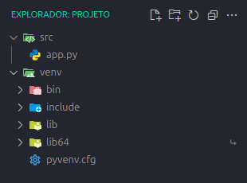

# 
 Gerador de Ambientes 

# Sober :
O **Gerador de Ambientes** é uma interface gráfica desenvolvida com `CustomTkinter` que automatiza a criação de projetos com ambientes virtuais em **Python** (usando `venv`) e **JavaScript** (com `Vite + React`).

>  ! Por enquanto só há verção pra Linux.

---

# Interface
### De inicio ele só tem duas opções ( Python Venv ) e ( JavaScript react )  

  ㅤ
  ㅤ
  ㅤ

### Cada opção abre uma tela própria, com campos para nome e um botão para selecionar o diretório  

## Checkboxs :
### [ㅤ] ABRIR NO VSCODE APÓS CRIAR? :  
- Abre o VsCode após o projeto ser criado ( Se o VsCode estiver instalado )  
### [ㅤ] ABRIR A PASTA APÓS CRIAR? :
- Abrir a pasta do projeto no gerenciador de arquivos
### [ㅤ] GERAR UM PROJETP LIMPO? :
- Gerar um projeto limpo (remove arquivos desnecessários)

---

# Exemplos de uso :

  ㅤ
  ㅤ
  ㅤ

---

# Autor : 
## Desenvolvido : por **[Thiago Henrique Rodrigues Moura](https://github.com/ThiagoHenriqueRm)**

---